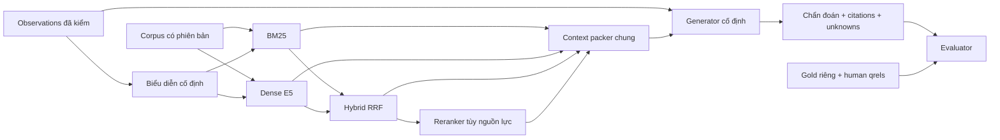
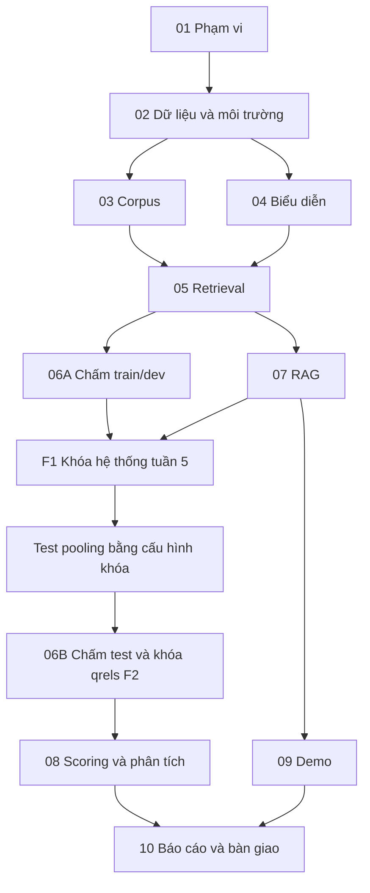

# Master plan CS221: AIOps với Hybrid RAG có dẫn chứng

Kế hoạch đưa đề tài **Phân loại sự cố và hỗ trợ chẩn đoán nguyên nhân gốc cho microservices bằng Hybrid RAG có dẫn chứng** từ bộ nghiên cứu đã có đến thí nghiệm, demo và báo cáo. Nhóm xác nhận **khoảng 8 tuần, 3 người, Kaggle miễn phí và DeepSeek V4.1 Flash API nếu giảng viên cho phép**. Ngày bắt đầu/hạn nộp chưa chốt nên lịch dùng tuần tương đối.

Đọc master để nắm phạm vi và lịch; mở [mục lục 10 plan độc lập](../260913-independent-plans-index.md) để chọn phần triển khai. Từ đợt chi tiết hóa ngày 13/09/2026, **mỗi mục có thư mục riêng với plan.md và ba phase**. Các phase ở thư mục master giữ mô tả lịch sử; checklist triển khai cập nhật trong plan độc lập, không theo dõi hai backlog song song. [Căn cứ ban đầu](research/research-evidence.md) và [phân tích bổ sung](../reports/260913-independent-plans-research.md) ghi các quyết định. Viết xong kế hoạch không có nghĩa mô hình hay annotation đã hoàn thành.

**Làm rõ ownership khi tách plan:** 04 bàn giao variants; 05 bàn giao runners/pilot; 07 bàn giao adapter/pilot train/dev. Plan 08 sở hữu dev selection, F1, điều phối test pooling và final runs; plan 06 sở hữu human annotation cùng F2. Xem [quy ước giao diện và mốc bàn giao](../reports/260913-independent-plans-contracts.md). Những mốc 04B/05B/07B trong mô tả ban đầu được thực hiện theo ownership này; không cộng thêm effort hoặc yêu cầu các plan chờ nhau hoàn tất phần test.

## 1. Hiện trạng và mục tiêu

| Thành phần | Đã có | Cần hoàn thiện |
|---|---|---|
| Đề cương | Tên đề tài, 3 RQ, nguyên tắc đánh giá | Khóa protocol theo rubric và nguồn lực nhóm |
| Dataset | 90 RE2–Online Boutique incidents; 270 Parquet; raw khoảng 0,92 GB | Audit input/units/aliases, privacy và pipeline Kaggle |
| Split | 54 train / 18 dev / 18 test; 30 service×fault families | Duyệt, khóa; số family tương ứng 18 / 6 / 6 |
| Knowledge | Historical 74 tài liệu/580 chunks; current 73/598 | Applicability, metadata derivative, snapshot cuối |
| Literature | 1.009 records, 50 reading notes | Đọc sâu 8–12 bài dùng thật trong báo cáo |
| Retrieval | BM25 preview; 20 train ca/400 candidates | Runner BM25/dense/hybrid, optional rerank |
| Annotation | Forms/rubric; **0 human judgments** | Qrels, answerability, reference claims, agreement |
| Generation/kết quả | Cards/config tham khảo; chưa chạy baseline quality | Generator, citations, thí nghiệm, phân tích, demo |

Nguồn hiện trạng: [START-HERE](../../START-HERE.md), [completion summary](../../05_research/completion-summary.json), [annotation status](../../03_collection_plan/annotation-kit/status.json). Không cần tải lại toàn bộ dữ liệu hay đọc hết danh mục paper để bắt đầu. Giữ bộ gốc làm mốc; sản phẩm triển khai dự kiến nằm trong `06_implementation/`, hiện chưa được tạo bởi kế hoạch này.

**Đầu vào:** observations của incident trong cửa sổ hồi cứu, log chọn lọc, service identifiers, metrics/traces có semantics đã kiểm. **Đầu ra:** service/fault nghi ngờ, giải thích ngắn liên kết evidence IDs, phần chưa biết và bước kiểm tra đề xuất. Gold chỉ nằm ở evaluator.

**Thành công:** hoàn thành một so sánh công bằng, không rò rỉ, có nhãn người và tái lập được. Hybrid không cải thiện vẫn là kết quả hợp lệ; không đặt mức tăng accuracy bắt buộc hoặc đổi thí nghiệm để tìm kết quả đẹp.

## 2. Phạm vi khoa học

**RQ2 — trọng tâm:** Hybrid BM25+dense có cải thiện evidence retrieval so với từng retriever riêng? Primary metric đề xuất: **passage nDCG@5**. Primary contrast: hybrid so với baseline đơn tốt hơn trên dev; nếu dev hòa chọn BM25. Khóa lựa chọn trước test. Document-level là secondary: collapse các chunk theo document, lấy thứ hạng xuất hiện đầu tiên và relevance document từ trường chấm riêng.

**RQ3 — lớp ứng dụng:** khi cố định generator và context budget, retrieval ảnh hưởng thế nào đến service localization, support của lời giải thích và abstention? Chấm riêng độ đúng chẩn đoán, chất lượng citations và thiếu thông tin.

**RQ1 — phân tích phụ:** trên train/dev so sánh log được chọn, log chuẩn hóa giữ thực thể và incident bundle; chọn một biểu diễn cho test. Reranker là ablation mở rộng đầu tiên sau bộ ba baseline. Không chạy tích mọi representation × retriever × corpus × generator.

MVP: một hệ thống Online Boutique, một corpus chính, BM25/dense/hybrid, một generator được phép dùng, no-RAG đối chứng, human qrels và đánh giá output, bảng theo incident/family, demo đơn giản và hướng dẫn tái lập. GraphRAG, multi-agent, fine-tuning, Train Ticket, multilingual benchmark và tự động sửa hệ thống nằm ngoài đường bắt buộc.

Giữ cách mô tả **hỗ trợ phân tích sự cố offline**. Gold fault injection hỗ trợ chấm định vị service; không tự chứng minh causal chain, giảm MTTR hay hiệu quả khắc phục production. Kho paper phục vụ related work, không đưa vào knowledge base vận hành. Các giới hạn kế thừa [đề cương](../../00_plan/project_proposal.md) và [thiết kế nghiên cứu](../../05_research/method-and-experiment-design.md).

## 3. Kiến trúc và lựa chọn kỹ thuật

| Hướng | Đánh đổi | Quyết định |
|---|---|---|
| RE2-OB + corpus hiện có | Đúng đề tài, cần qrels và compatibility review | Hướng chính |
| TechQA/MTRAG technical QA | Có thể giảm khó khăn mapping telemetry, nhưng đổi nhiệm vụ | Dự phòng nếu pilot thiếu evidence; sửa scope với giảng viên |
| Graph/multi-agent/fine-tuning | Tăng thành phần, dữ liệu và chi phí đối chứng | Hoãn sau MVP |

E5-small-v2 là ứng viên dense khởi đầu cho query/corpus tiếng Anh: prefix query/passage, vector 384 chiều, giới hạn 512 tokens theo [model card](https://huggingface.co/intfloat/e5-small-v2). Báo cáo/giao diện có thể tiếng Việt; ngôn ngữ output đánh giá phải khóa thống nhất. Với khoảng 580 chunks, exact dense search và BM25 cục bộ đủ đơn giản để pilot; chưa cần vector database.

RRF hợp thứ hạng BM25/dense; constant 60, depth 50 mỗi nhánh, hybrid top-50 cho rerank và top-5 context là **điểm bắt đầu cần kiểm trên dev**, không phải cấu hình đã đo thắng. [RRF, SIGIR 2009](https://cormack.uwaterloo.ca/cormacksigir09-rrf.pdf). Reranker nhận cặp query–passage; giới hạn input phải áp dụng cho cả cặp. [BGE reranker card](https://huggingface.co/BAAI/bge-reranker-base).

Giữ cùng content field `section_heading + text`. Audit query hiện lấy tám log đầu sau khi sắp theo service/time, có nguy cơ bỏ service ở cuối thứ tự. Corpus có 12 title copyright từ YAML/config: chuẩn hóa metadata derivative theo path/service nếu cần, giữ raw/hash. Mọi thay đổi tạo corpus/query version mới trước qrels cuối.

Budget generation đề xuất cho pilot: observations ≤2.048 tokens; knowledge ≤4.096; output ≤768; system/prompt thống kê riêng. Kiểm tokenizer/usage thực; ước lượng phải ghi là ước lượng. Encoder E5/reranker có giới hạn riêng, cần log truncation và áp dụng content policy nhất quán.

## 4. Lịch 8 tuần và điều kiện chuyển bước

| Tuần | Công việc chính | Đầu ra và gate |
|---|---|---|
| 1 | Khóa đề bài/rubric; phân A/B/C; Kaggle CPU; audit 5 train ca; hỏi thầy về API | **G0:** protocol v1, decision log, input/gold boundary, checklist nguồn lực |
| 2 | Corpus applicability; query; BM25/dense pilot; calibration rubric; đo công chấm | **G1:** data/corpus/query v1 hợp lệ; quyết định API/fallback trước cuối tuần |
| 3 | Hybrid; pool đủ phương pháp; hai người chấm 20 train pilot, bắt đầu dev | **G2:** pilot qrels, agreement trước adjudication, evidence coverage và rubric được review |
| 4 | Hoàn thành 18 dev qrels; no-RAG/RAG; bảng dev đầu tiên | **G3:** ba retrievers + một generator, citations hợp lệ, không lộ gold |
| 5 | Ablation giới hạn; optional rerank; sửa từ dev; khóa thiết kế | **G4/F1:** corpus/query/models/prompt/params/evaluator và primary comparison đã khóa |
| 6 | Test pooling sau F1; chấm mù 18 test ca; adjudicate; chạy final | **G5/F2:** qrels test khóa; mọi final top-5 đã chấm; responses/runs được lưu |
| 7 | Human output review; thống kê theo family; lỗi; demo | **G6:** metrics/counts, sáu family deltas, 6–10 failure/success cases, bản thảo |
| 8 | Kiểm tái lập; báo cáo/slides; diễn tập và dự phòng | **G7:** gói nộp, manifest, hướng dẫn, demo backup và claim–evidence audit |

Viết related work/phương pháp từ tuần 1; ghi nhật ký mỗi thí nghiệm. Tuần 3–4 đặt lịch annotation chung, không dồn toàn bộ cho thành viên dữ liệu.

Phase 06/08 có các mốc xen kẽ. Test retrieval để tạo pool chỉ chạy sau F1; scoring test chỉ sau F2. Không đặt yêu cầu có qrels test trước mọi lần retrieval test vì sẽ tạo vòng phụ thuộc. Nhãn test không được phản hồi vào tuning. Generation và khung demo có thể xây trước khi phase 06/test hoặc phase 08 hoàn tất; dữ liệu demo cuối cập nhật sau đánh giá.

## 5. Phân công và tổng công

| Vai trò | Trách nhiệm | Kiểm tra chéo |
|---|---|---|
| A — dữ liệu/tri thức | Data contract, payload privacy, corpus, nhãn | Sources/leakage, tham gia chấm |
| B — retrieval/thực nghiệm | Query, BM25/dense/hybrid/rerank, evaluator/thống kê | Context packing, tham gia chấm |
| C — RAG/tích hợp | DeepSeek/fallback, citations, demo, biên tập báo cáo | IDs/split/provenance, tham gia chấm |

Hai người chấm độc lập, người còn lại adjudicate; xoay cặp để chia tải. Test annotation diễn ra sau freeze; không gửi gợi ý cải tiến từ test cho người phát triển. Nhóm ba người có giới hạn độc lập của human evaluation: ghi thật trong báo cáo, không tuyên bố blind review bên ngoài.

| Gói | Giờ-người dự kiến |
|---|---:|
| 01 Phạm vi / 02 Dữ liệu và môi trường / 03 Corpus | 12 / 24 / 24 |
| 04 Biểu diễn / 05 Retrieval | 20 / 36 |
| 06 Annotation, qrels và reference | 84–150 |
| 07 Generation / 08 Đánh giá và phân tích | 28 / 40 |
| 09 Demo / 10 Báo cáo và bàn giao | 12 / 28 |
| **Tổng trực tiếp** | **308–374** |
| **Có dự phòng 20%** | **370–449** |

Tương đương khoảng **15,4–18,7 giờ/người/tuần**. Đây là dự toán chưa đo, không phải cam kết giờ đã được nhóm xác nhận. Nếu chỉ có 8–10 giờ/người/tuần, cần cắt ablation hoặc kéo dài lịch. Chốt lại sau 5 ca calibration cuối tuần 2.

## 6. Thiết kế annotation

Core set: **20 train + 18 dev + 18 test = 56 incident**, chấm đôi. Chọn train đại diện các family; seed pool cũ là điểm bắt đầu, không bắt buộc giữ nếu thiếu đại diện. 34 train còn lại giữ trong dữ liệu, qrels là mở rộng vì phương án chính không fine-tune. Không báo IR metrics cho ca chưa chấm.

Pool ban đầu lấy top-10 từ từng phương pháp được đánh giá, tối đa bốn nhánh: **≤40 cặp/incident trước dedup**; nếu bỏ reranker thì ≤30. 30–40 cặp thực là giả định dự toán, không cap để loại bớt final top-k. Depth retrieval 50 không đồng nghĩa chấm 50 từ mỗi hệ thống. Lưu số cặp thực, overlap, judged@k và mọi lần deepen.

56 × 30–40 × 2 = **3.360–4.480 judgments**. Với 45–75 giây/judgment, riêng relevance mất khoảng 42–93 giờ-người; cộng đọc ca, reference claims, adjudication và quản lý. Phase 06 dự trù 84–150 giờ và phải đo lại. Human review của output mô hình thuộc phase 08, tránh đếm công hai lần.

Rubric: mức relevance 0/1/2; evidence role (triệu chứng, định vị, cơ chế, bước kiểm tra); applicability; answerability. `Unjudged` khác 0. Che retriever/rank, shuffle có seed; giữ A/B trước adjudication, báo agreement và phân bố nhãn. **Mọi final top-5 phải được chấm**; evidence ngoài pool được bổ sung theo thủ tục thống nhất và lưu provenance.

G2 cần rubric rõ, bất đồng được xử lý và evidence coverage đủ cho câu hỏi đã chọn; không tự đặt ngưỡng kappa thành chuẩn CS221. Nếu pilot cho thấy tài liệu chỉ hỗ trợ bước kiểm tra, không đủ cause, ghi quyết định bổ sung có nguồn hoặc thu hẹp claim. Không loại âm thầm ca thiếu evidence.

## 7. Thí nghiệm và đánh giá

| Mã | Điều kiện | Mức ưu tiên |
|---|---|---|
| IR-B / IR-D / IR-H | BM25 / E5 / hybrid RRF, cùng query/corpus | Bắt buộc |
| IR-R | Hybrid top-50 → rerank | Khi pilot đủ tài nguyên |
| G0 | Observations → cùng generator, không external knowledge | Bắt buộc |
| GB / GD / GH | Observations + evidence BM25/dense/hybrid | Bắt buộc |
| GR | Observations + evidence reranked | Khi có IR-R |

18 test × 4 điều kiện bắt buộc = **72 responses**; có GR thì **90** cho một lượt cuối. 18 dev tương tự là 72–90; 20 train pilot ×5 =100. Một lượt đủ năm điều kiện trên 56 ca là 280 outputs. Đây là số lần gọi dự kiến, chưa có kết quả. Nhiều seeds/lần lặp không tăng số incident độc lập.

Giữ cùng observations, corpus, content policy, context allowance, generator, prompt template và decoding. G0 vẫn được dẫn observation IDs; không nhét văn bản rỗng để ép token bằng RAG. Gold/reference không vào prompt. LLM có thể hỗ trợ tooling, không giả thành người chấm độc lập.

| Lớp | Chỉ số | Cách diễn giải |
|---|---|---|
| Retrieval | Passage nDCG@5 primary; MRR@10, pooled Recall@20/50, judged@k secondary | Gain 2^rel−1; relevance nhị phân >=1; IDCG từ pooled qrels; MRR chỉ khi top-10 đã chấm |
| Diagnosis | Top-1/Top-3 service accuracy; đúng/tổng | Localization theo nhãn nguồn |
| Giải thích | Citation validity, support precision/coverage, unsupported claims | ID tồn tại chưa đủ chứng minh support |
| Thiếu thông tin | Answerability, abstain, coverage và độ đúng trên phần trả lời | Tránh “thắng” bằng im lặng |
| Tài nguyên | Latency từng công đoạn, usage, chi phí, lỗi/retries | Ghi thiết bị/cache, tách API latency với IR |

Pooled recall dùng các relevant evidence đã chấm làm mẫu số; không phải exhaustive recall và **không phải cận dưới bảo đảm** của recall thật. Ca không có relevant qrels được báo riêng; nDCG/recall không xác định theo protocol này, không tự biến thành 0/1. Vẫn báo diagnosis/abstention trên toàn bộ 18 test; các hệ thống dùng cùng mẫu số và liệt kê số ca đủ nhãn.

Test có **6 family**, mỗi family ba repetitions. Báo paired differences, bảng sáu family, counts và leave-one-family-out sensitivity. Nếu dùng bootstrap, resample family kèm toàn repetitions, ghi CI là thăm dò. Không coi log rows, claims hay repetitions độc lập để làm độ chắc chắn có vẻ lớn. Chất lượng câu trả lời và chất lượng trích dẫn cần chấm tách nhau, phù hợp hướng đánh giá của [ALCE](https://aclanthology.org/2023.emnlp-main.398/), nhưng rubric incident phải tự xây và hiệu chỉnh.

Human output review: chấm một lượt toàn bộ 72–90 test responses; chấm đôi thêm một incident mỗi family, đủ mọi cấu hình (24–30 responses). Chọn sáu incident và seed tại F1 trước xem outputs, che tên hệ thống, adjudicate bất đồng và báo agreement trên subset. Dự toán 5 phút/lượt cho 96–120 lượt là 8–10 giờ, cộng 4 giờ hiệu chỉnh/adjudication trong phase 08; đo lại tốc độ pilot và không giả rằng tất cả outputs được chấm đôi.

## 8. Kaggle, DeepSeek và chi phí

Kaggle dành cho kiểm dữ liệu, embedding, optional reranker và local-model fallback. Pandas/BM25/annotation dùng CPU. Tài liệu Kaggle nêu quota tuần thay đổi theo nguồn lực: **quota và GPU hiển thị trong tài khoản lúc chạy mới là căn cứ**. Không cộng quota ba tài khoản thành bảo đảm tài nguyên. [Kaggle GPU guidance](https://www.kaggle.com/docs/efficient-gpu-usage).

Cache embeddings theo corpus+model hash; checkpoint theo incident/config; xuất kết quả sau batch; dùng private inputs/notebooks cho dữ liệu được phép chia sẻ. Một người điều phối bộ chạy chuẩn. Không nạp toàn bộ hàng triệu trace spans cho mỗi query. Payload gửi API phải là export đã duyệt; API key ở secret store, không trong notebook/output.

DeepSeek công bố V4.1 Flash ngày 10/09/2026, tên API là **`deepseek-flash`**, alias cũ có thể chuyển model. Ghi model request/response nếu có, UTC, request ID, prompt/config hashes và usage; nếu không có revision bất biến thì chỉ cam kết tái lập cấu hình + cache outputs. [Thông báo chính thức](https://www.deepseek.com/en/news/deepseek-v4-1-flash/).

Giá trực tiếp kiểm ngày 13/09/2026: peak input cache miss **$0,30/triệu token**, output **$1,20/triệu token**; dùng hai mức này để dự toán bảo thủ, kiểm lại trước khi chạy. [DeepSeek Models & Pricing](https://api-docs.deepseek.com/quick_start/pricing/).

Ví dụ 280 requests, trung bình 7.000 input +768 output tokens/request, non-thinking, chưa retry: 1,96 triệu input +0,21504 triệu output → **khoảng $0,85/lượt**; ba lượt khoảng $2,54. Đây là phép tính giả định, không hóa đơn, mức nạp tối thiểu hay cam kết chi phí. Thinking tokens, retries, output dài và giá thay đổi phải tính theo usage thật. Đề xuất trần nội bộ **$10–15** để nhóm chốt ở phase 01; chưa coi là ngân sách đã được duyệt.

Tuần 1 hỏi giảng viên quyền dùng API, yêu cầu khai báo và quyền dùng open-weight local. Nếu cuối tuần 2 API chưa được phép, tiếp tục IR/annotation; pilot một model nhỏ 1.5B–4B có license/revision rõ nếu thầy cho phép, đo chạy thật trên Kaggle rồi chọn. **Không dự kiến self-host toàn bộ DeepSeek V4.1 Flash trên Kaggle free.** Nếu mọi generator đều không được phép, xin điều chỉnh thành retrieval/extractive assistance và ghi RQ3 chưa thực hiện.

## 9. Rủi ro và thứ tự cắt giảm

| Rủi ro | Tín hiệu | Xử lý |
|---|---|---|
| Corpus cũ nhưng sai deployment | Applicability không đủ chứng cứ | Giữ unknown; bổ sung trước freeze hoặc giới hạn claim |
| Annotation quá tải | Phút/pair hoặc pool tăng | Cắt ablation/34 train mở rộng; giữ chất lượng dev/test |
| Query mất service/error | Audit clipping/tokenization | Sửa trên train, version lại trước qrels cuối |
| Gold lộ qua path/metadata | Payload có label/original case/injection | Input allowlist; giữ service từ observations hợp lệ |
| Kaggle thiếu GPU/mất session | Quota/session pilot | Cache/resume/job ngắn; CPU cho IR nhỏ |
| API lỗi/đổi model/chưa phép | Preflight và G0 | Fallback, run theo cùng đợt, log failures/retries |
| Citation đúng ID nhưng sai support | Human output review | Chấm support/applicability riêng; báo abstention |
| Hybrid không thắng | Paired results | Báo kết quả âm/thăm dò; không đổi metric hay loại ca sau test |

Cắt theo thứ tự: giao diện trang trí → embedding thứ hai → snapshot/cross-system ablation → reranker → representation ngoài dev. Giữ BM25/dense/hybrid, đánh giá người và chống leakage. Kế hoạch này giữ đủ 18 test incidents và 56 core qrels; cắt 34 train mở rộng trước. Thay đổi core/test là sửa protocol/phạm vi riêng cần thống nhất lại, không phải thao tác tiết kiệm mặc định; tuyệt đối không loại ca theo điểm test.

## 10. Bảy ngày đầu tiên

1. **Ngày 1:** đọc đề cương/hiện trạng, điền protocol một trang, phân A/B/C, xác định rubric/hạn nộp và gửi đề nghị API.
2. **Ngày 2:** A+B kiểm 5 train incidents: observations, row provenance, nhãn riêng, clipping; C lập checklist môi trường/export.
3. **Ngày 3:** A review mẫu corpus; B chạy BM25 preview; C thử Kaggle CPU, cache và lưu outputs.
4. **Ngày 4:** chia đọc RCAEval, retrieval/RRF, grounded evaluation; viết bảng claim–source–giới hạn.
5. **Ngày 5:** B chuẩn bị dense smoke test; A+C calibration 5 ca trên pool sẵn có, nhãn chỉ phục vụ hiệu chỉnh.
6. **Ngày 6:** sửa rubric/query/corpus từ train; đo phút/pair, token và thời gian chạy.
7. **Ngày 7:** họp G0/G1 ban đầu, khóa backlog tuần 2 và người phụ trách; IR/annotation tiếp tục dù API đang chờ.

## Phases

| # | Kế hoạch | Trạng thái |
|---|---|---|
| 1 | [Khởi động, chốt phạm vi và phân công](./phase-01-start.md) | todo |
| 2 | [Dữ liệu và môi trường chạy](./phase-02-data-and-environment.md) | todo |
| 3 | [Kho tri thức và điều kiện áp dụng](./phase-03-knowledge-corpus.md) | todo |
| 4 | [Biểu diễn incident và kiểm soát đầu vào](./phase-04-incident-representation.md) | todo |
| 5 | [Ba baseline retrieval và reranker tùy chọn](./phase-05-retrieval-baselines.md) | todo |
| 6 | [Annotation, qrels và answerability](./phase-06-annotation-and-qrels.md) | todo |
| 7 | [Sinh chẩn đoán có dẫn chứng và kiểm soát chi phí](./phase-07-grounded-generation.md) | todo |
| 8 | [Khóa test, đánh giá và phân tích lỗi](./phase-08-evaluation-and-analysis.md) | todo |
| 9 | [Demo hỗ trợ điều tra với bằng chứng kiểm tra được](./phase-09-demo.md) | todo |
| 10 | [Báo cáo, tái lập và bàn giao đồ án](./phase-10-report-and-release.md) | todo |

## Dependencies

Kế hoạch kế thừa `00_plan/` và đợt chuẩn bị `05_research/`. Master nay là overview của mười plan độc lập. `blockedBy` của master theo dõi điều kiện hoàn tất toàn bộ chương trình; các plan con không chờ master completed để bắt đầu. Dependencies kỹ thuật và các mốc partial completion/F1/F2 nằm trong plan độc lập cùng phụ lục bàn giao, không yêu cầu tuần tự kết thúc cả mười gói.

## Success Criteria

- [ ] Protocol có RQ/primary metric/contrast, đơn vị incident/family, nguồn lực và điều kiện API.
- [ ] Data/query/corpus/split versioned; inference không đọc gold.
- [ ] Human qrels/reference/answerability có A/B, adjudication và quy tắc unjudged.
- [ ] BM25/dense/hybrid và RAG/no-RAG trên cùng protocol; optional rerank ghi trạng thái rõ.
- [ ] F1/F2, per-incident results, sáu family deltas và giới hạn được báo trung thực.
- [ ] Demo có evidence/unknowns; report có sources/failure cases/hướng dẫn tái lập.

## Validation Log

Nhóm đã xác nhận 8 tuần, 3 người, Kaggle free và DeepSeek V4.1 Flash phụ thuộc giảng viên. Review nội dung, kiểm artifact và nguồn được lưu ở `reports/` và `research/`. Không chạy thí nghiệm hay tạo human judgments trong đợt lập kế hoạch này.

## Những thông tin chốt trong tuần 1

Hạn nộp/rubric chính thức; giờ mỗi người cam kết; xác nhận quyền dùng API/local model; trần tiền thực tế; quyền chia sẻ derivative data; ngôn ngữ output chấm. Các điểm mở đều có đầu việc và nhánh xử lý, không ngăn bắt đầu audit và baseline.
