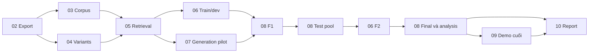

# Mười kế hoạch triển khai độc lập cho đồ án CS221

Mỗi hạng mục dưới đây là **một plan riêng**, có thư mục, `plan.md`, ba phase chi tiết và checklist riêng. Đây là mục lục điều phối; không thay thế nội dung của mười plan. Tất cả đang **pending triển khai**.

Kế thừa phạm vi 8 tuần/3 người trong [master](260913-0020-cs221-aiops-rag-master-plan/plan.md). Bản chi tiết mới được lập ngày 13/09/2026 từ tài liệu và audit source/artifacts; đầu ra của đợt này là kế hoạch, chưa có thí nghiệm hoặc human judgments mới.

## Chọn một plan để bắt đầu

| Plan độc lập | Sản phẩm chính | Codex có thể đảm nhận | Phần cần người/đầu vào ngoài | Giờ-người dự kiến |
|---|---|---|---|---:|
| [01 — Phạm vi, protocol và phân công](260913-0057-cs221-01-scope-and-protocol/plan.md) | Charter, literature matrix, decision log | Soạn và đối chiếu tài liệu; draft nội dung xin phép | Rubric, lịch, cam kết nhóm, quyết định giảng viên | 12 |
| [02 — Dữ liệu và môi trường](260913-0057-cs221-02-data-and-environment/plan.md) | Export an toàn, schema/units, runtime và notebook | Audit, converter, validator, manifests | Quyền chia sẻ; tài khoản và kiểm payload | 24 |
| [03 — Kho tri thức](260913-0057-cs221-03-knowledge-corpus/plan.md) | Corpus derivative, citation registry, applicability | Metadata/chunking/tokenizer/dedup/offsets | Review tính áp dụng của tài liệu | 24 |
| [04 — Biểu diễn incident](260913-0057-cs221-04-incident-representation/plan.md) | R1/R2/R3, selection/truncation ledger | Renderer, technical-entity tests, variants | Review tín hiệu train; chọn cuối ở 08 | 20 |
| [05 — Baseline retrieval](260913-0057-cs221-05-retrieval-baselines/plan.md) | BM25/dense/RRF và runner/pool inputs | Index/cache/fusion/ranking/edge-case checks | Quyết định optional reranker sau pilot | 36 |
| [06 — Annotation và qrels](260913-0057-cs221-06-annotation-and-qrels/plan.md) | Qrels core56, A/B, references, agreement, F2 | Pool/forms/merge/integrity/agreement/export | Hai người chấm độc lập, adjudicator | 84–150 |
| [07 — Generation có dẫn chứng](260913-0057-cs221-07-grounded-generation/plan.md) | Provider, context/validator, cache/budget, pilot | Adapter, mocks, runner và các kiểm tra lỗi | API/local model được phép; key/trần chi | 28 |
| [08 — Freeze, đánh giá và phân tích](260913-0057-cs221-08-evaluation-and-freeze/plan.md) | F1, final runs, metrics/family analysis | Dev selection tooling, evaluator, statistics | Human output review; protocol deviations | 40 |
| [09 — Demo bằng chứng](260913-0057-cs221-09-evidence-demo/plan.md) | Local viewer, cache/live labels, backup | Giao diện tối thiểu và citation navigation | Tổng duyệt; quyền live nếu dùng | 12 |
| [10 — Báo cáo và bàn giao](260913-0057-cs221-10-report-and-release/plan.md) | Report/slides, reproduction, package | Draft, bảng/hình từ results, checks | Xác nhận nội dung, đóng góp và nộp bài | 28 |

Tổng trực tiếp **308–374**, có dự phòng 20% khoảng **370–449 giờ-người**. Đây là dự toán chưa đo, không phải số giờ Codex cam kết tiết kiệm. Ngày bắt đầu/hạn nộp chưa chốt nên dùng tuần tương đối.

## Bắt đầu và làm song song

- **Ngay đầu:** 01; đồng thời audit local của 02. 01 theo dõi quyền API, không chặn đọc dữ liệu/viết tooling local.
- **Sau export:** 03 và 04 cùng làm; 05 nhận corpus+variants để tạo pilot.
- **Đường găng:** 06 dựng rubric/calibration sớm; khi có 05 thì chấm train/dev. 07 xây mock/provider/context song song với annotation.
- **Khóa cuối tuần 5:** 08 dùng runners/pilot và qrels dev để chọn representation/contrast, chốt F1.
- **Tuần 6:** 08 tạo test pool bằng F1 → 06 chấm test/khóa F2 → 08 chạy final và tính điểm. Không đợi qrels test trước mọi lần retrieval test.
- **Tuần 7–8:** 09 hoàn thiện dữ liệu trình diễn và 10 hoàn thiện báo cáo; khung demo và related work có thể viết từ sớm.

04/05/07 nghiệm thu variants, runners và pilot; **08 sở hữu lựa chọn cấu hình cuối cùng và chạy test**. 06.dev và 06.F2 là hai mốc khác nhau; không đánh dấu 06 completed chỉ vì đã chấm xong dev.

## Cách dùng từng plan

1. Mở `plan.md` của đúng mục; kiểm đầu vào, phạm vi và người chịu trách nhiệm.
2. Đọc phase cần thực hiện và giao một đầu việc có task ID. Mỗi phase có file inventory, giao diện, các bước, nghiệm thu và xử lý lỗi.
3. Chỉ đánh dấu hoàn tất bằng artifact/check thực, giữ nguyên nhãn pending khi còn cần người chấm hoặc quyền chạy thật. Lệnh trong phase ghi dự kiến phải được hiện thực hóa trước khi chạy.
4. Một goal triển khai nên nhận một plan hoặc một mốc đã đủ đầu vào. Giữ checklist/checks; không thay dữ liệu/nhãn/tiêu chuẩn để ép goal hoàn tất.

Ví dụ phạm vi công việc tiếp theo có thể giao: hoàn thiện plan 02 từ audit đến export local và smoke tests, bàn giao phần Kaggle/API với trạng thái thật nếu còn thiếu quyền. Không tự mở cả mười gói trong một goal triển khai.

## Tài liệu hỗ trợ

- [Phân tích nguồn, lựa chọn phương án và khả năng của Codex](reports/260913-independent-plans-research.md).
- [Quy ước giao diện, ownership và F1/F2](reports/260913-independent-plans-contracts.md).
- [Kết quả rà soát và giới hạn nghiệm thu bộ plan](reports/260913-independent-plans-review.md).
- [Master gốc](260913-0020-cs221-aiops-rag-master-plan/plan.md) và [mục lục cũ đã nối sang plan mới](260913-0020-cs221-aiops-rag-master-plan/detail-plan-index.md).

## Quyết định còn mở

Hạn nộp/rubric, tên và số giờ mỗi người, API/local-model approval, trần tiền và ngôn ngữ output thuộc plan 01. Applicability, units, tốc độ chấm, evidence coverage và tài nguyên thực thuộc pilot của 02/03/06/07. Có thể bắt đầu các phần local/tooling trước các quyết định này; không coi chúng đã được duyệt.
