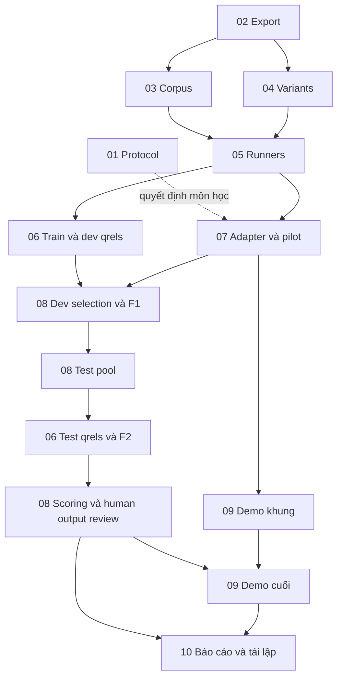

# Quy ước bàn giao giữa 10 kế hoạch CS221

Đây là phụ lục dùng chung cho mười plan độc lập, phiên bản thiết kế ngày 13/09/2026. Nó xác định giao diện và mốc bàn giao; đầu việc chi tiết, checklist và người phụ trách nằm trong từng plan. Tất cả đường dẫn thuộc `06_implementation/` là **đề xuất chưa triển khai**.

## Hợp đồng của đợt lập kế hoạch

- **Kết quả:** mỗi mục 01–10 của master có một thư mục độc lập, một `plan.md`, ba phase triển khai chi tiết, ranh giới Codex/người và bằng chứng nghiệm thu.
- **Ràng buộc:** kế thừa phạm vi 8 tuần/3 người trong master; giữ dữ liệu nguồn, split 54/18/18, qrels cho 56 core incidents, ba IR/bốn generation conditions bắt buộc; API vẫn có điều kiện giảng viên.
- **Ngoài phạm vi đợt này:** tải weights, viết/chạy ứng dụng nghiên cứu, tạo nhãn người, gọi generator có phí, gửi thư, upload hoặc nộp đồ án.
- **Điều kiện hoàn tất kế hoạch:** đủ 10 plan/30 phase; liên kết và dependency hợp lệ; nhiệm vụ có đầu vào/đầu ra/owner/gate; đọc chéo không còn mâu thuẫn nghiêm trọng. Trạng thái triển khai vẫn pending.

## Trách nhiệm và thứ tự thẩm quyền

1. Các plan độc lập là nơi cập nhật đầu việc triển khai; master giữ lịch/phạm vi tổng thể. Phase trong master là mô tả lịch sử, không là backlog thứ hai.
2. Khi triển khai, protocol được nhóm duyệt và manifest F1/F2 mới là cấu hình của thí nghiệm. Các giá trị pilot trong kế hoạch chưa phải kết quả hay tham số thắng.
3. A phụ trách dữ liệu/tri thức, B retrieval/thực nghiệm, C generation/tích hợp; đây là vai trò chưa thay tên người thật.
4. Codex có thể soạn tài liệu, viết tooling, chạy kiểm tra và phân tích kết quả được cung cấp. Người chấm chịu trách nhiệm relevance/applicability/reference/support; giảng viên quyết định quyền dùng mô hình. Hai agent không thay thế hai người chấm.
5. Trong mỗi plan, `blockedBy` ghi điều kiện để nhận đủ đầu vào kỹ thuật. Công việc đọc nguồn, soạn schema và viết fixture có thể bắt đầu sớm nếu phase cho phép. Mốc xen kẽ được ghi riêng để không tạo vòng chờ cả plan.

## Các mốc có sản phẩm cụ thể

| Mốc | Chủ sở hữu | Cần có | Sản phẩm và nơi nhận |
|---|---|---|---|
| 01.protocol | 01 | Rubric/thời hạn/nguồn lực hoặc decision pending có owner | Charter và decision log; mọi plan dùng |
| 02.export | 02 | Audit source, schema và units | Inference export được lọc + private audit mapping; 03/04 nhận |
| 03.corpus | 03 | 02 contract, review nguồn | Corpus derivative có version/ID/offset/applicability; 05/07 nhận |
| 04.variants | 04 | 02 export | R1/R2/R3 và selection ledger, chưa chọn thắng; 05/08 nhận |
| 05.runners | 05 | 03 corpus + 04 variants | BM25/dense/RRF, train pilot rankings, optional reranker; 06/07/08 nhận |
| 06.dev | 06 phase 2 | Pool các cấu hình train/dev được thử | 20 train+18 dev qrels chấm đôi, references/answerability, agreement; 08 nhận |
| 07.pilot | 07 | 05 runners, API/fallback được phép để gọi thật | Adapter, context/validator, output pilot và ledger; 08/09 nhận |
| 08.F1 | 08 phase 1 | 06.dev + 05.runners + 07.pilot | Khóa mọi lựa chọn bằng train/dev; cho phép tạo test pool |
| 08.test-pool | 08 phase 2, dùng tooling 04/05/06 | F1 hợp lệ | Materialize test query/bundle riêng bằng rules 04 đã khóa → immutable input manifest → ranking test → pool cho 06 phase 3 |
| 06.F2 | 06 phase 3 | Test pool sau F1; hai người và adjudication | Qrels test đóng băng, link F1 và coverage; 08 scoring nhận |
| 08.results | 08 phase 2–3 | F1/F2, final generation và review | Per-incident/per-family metrics, failures và analysis; 09/10 nhận |
| 09.demo | 09 | 07 giao diện output; kết quả cuối từ 08 | Demo cục bộ/backup và citation viewer; 10 nhận |
| 10.release | 10 | 08.results+09.demo | Report, slides, reproduction receipts, package manifest |

**Tránh vòng phụ thuộc:** 04 kết thúc khi có variants/tooling, 05 kết thúc khi có runners/pilot, 07 kết thúc khi có adapter/pilot. Chọn representation và baseline đơn mạnh hơn thuộc 08, với qrels dev từ 06. Không yêu cầu 06 hoàn tất phần test trước khi 08 bắt đầu.

## Ranh giới tệp và dữ liệu

Workspace: `C:/Users/Siinn/Downloads/CS221_AIOps_RAG_Research_Pack`. Root triển khai dự kiến: `C:/Users/Siinn/Downloads/CS221_AIOps_RAG_Research_Pack/06_implementation`.

| Vùng đề xuất | Người sở hữu schema | Nội dung | Quy tắc đọc |
|---|---|---|---|
| docs/project-charter.md; docs/decision-log.md | 01/C | Protocol và quyết định | Mọi nhóm đọc; owner hợp nhất thay đổi |
| data/inference/ | 02/A | Observations/evidence khử định danh, ID opaque | Inference chỉ dùng allowlist tường minh |
| data/private/ | 02/A | split-map.tsv, ground_truth.jsonl, raw path/row map, audit provenance | Điều phối/evaluator; không serialize vào query/prompt/index |
| data/knowledge/ | 03/A | Document/chunk registry và phiên bản corpus | Chỉ nội dung và metadata được duyệt vào index/context |
| queries/ và configs/representation.yaml | 04/B | Các variant, selection/token ledger | Tuning train/dev; test dùng F1 |
| src/retrieval/; configs/retrieval.yaml | 05/B | Runner/index/fusion | Không đọc gold/qrels để xếp hạng |
| annotations/ | 06/A | Pool manager, blinded forms, original A/B, qrels, reference | Manager kiểm soát; không làm knowledge |
| src/generation/; configs/generation.yaml | 07/C | Context builder/provider/validator/runner | Không tool execution; chỉ export đã duyệt |
| freezes/; configs/evaluation.yaml | 08/B | F1/F2 link, evaluation protocol | 06 sở hữu nội dung nhãn F2; 08 kiểm chain |
| runs/; results/ | 08 điều phối; 05/07 ghi qua runner | Immutable output theo run_id | Không ghi chung file giữa hai tiến trình |
| src/demo/; configs/demo-cases.yaml | 09/C | Local viewer, kịch bản | Không nhúng key; live tùy chọn |
| reports/final-*; docs/reproduce.md | 10/C | Báo cáo, figures, reproduction | Chỉ số lấy từ results đã khóa |

Không chép raw dataset để tạo corpus. Không dùng toàn bộ `prepare-incidents.py` như runtime inference vì script chuẩn bị còn tạo nhãn và gắn family/split. Không chạy lại validator gói chuẩn bị để hợp thức hóa kết quả mới: validator ấy chủ động đòi 0 judgments/NOT_RUN.

## Các trường phải khớp giữa producer và consumer

Đây là giao diện tối thiểu cần hiện thực hóa trong schema; plan sở hữu có thể bổ sung trường audit nhưng không đổi tên/ý nghĩa trường dùng chung mà bỏ quên consumer.

| Artifact | Trường/chính sách tối thiểu |
|---|---|
| Inference incident | `incident_id`, observation window có unit, observations/evidence IDs, redaction+schema version; không family/split/injection/original case path |
| Private join | `incident_id` → `split`, `scenario_family_id`, service/fault gold, provenance; phép join chỉ ở evaluator |
| Query | `incident_id`, representation ID/version, query text/hash, selected/dropped evidence ledger, tokenizer budget; manager metadata không đi vào text |
| Common observation bundle | `queries/observation-bundles.jsonl` do 04 tạo cho train/dev: incident/window/evidence và bundle_hash; 08 gọi cùng functions sau F1 để tạo `queries/test/observation-bundles.jsonl`; 07 đọc đúng manifest/version, không tự chọn lại từ raw |
| Test input manifest | `queries/test/test-input-manifest.json` do 08 tạo sau F1: F1_hash, opaque incident IDs, frozen renderer/config/tokenizer hashes, `queries/test/queries.jsonl` và test bundle hashes; chỉ input metadata được duyệt, không nhãn; không sửa file train/dev đã khóa |
| Chunk | `corpus_hash`, `chunk_id`, `document_id`, `section_heading`, `text`, normalized source offsets, source revision, applicability; text đổi thì ID/version đổi |
| Ranking | `run_id`, `condition`, `incident_id`, `chunk_id`, `document_id`, `rank`, `score`, query/corpus/config hashes; manifest ghi errors/empty/short runs |
| Passage judgments | incident+task/window version+corpus+chunk ID, annotator, grade 0/1/2 hoặc chưa chấm, evidence roles, applicability, original A/B và adjudication; các query hashes nằm trong pool provenance |
| Document judgments | Document target/grade riêng; không suy bằng max passage grade; optional secondary metric bị đánh dấu unavailable khi chưa chấm |
| Generation record | Incident/condition/run IDs; raw response và parsed payload; actual context IDs/hash, config/model/cohort, attempts/usage/status/error |
| Claim | Claim text, evidence IDs gắn từng claim, observation/inference type; ID tồn tại trong corpus nhưng không có trong actual context vẫn không hợp lệ |
| Metric row | Metric/condition/split/run/qrels versions, eligible denominator, value hoặc undefined reason; include failure counts |

Tất cả hashes dùng serialization ổn định. Quy định Unicode offsets là codepoint trên văn bản chuẩn hóa; không lẫn byte offsets. Không thay đổi source window chỉ để ép hai trường end bằng nhau: end inclusive của sample và end exclusive của cửa sổ phải có chuyển đổi được kiểm tại boundary.

**Relevance lấy incident làm đơn vị:** người chấm luôn thấy cùng full observations/task definition đã khóa. R1/R2/R3 chỉ đổi biểu diễn của tác vụ ấy, nên dùng chung judgment cho cùng incident/task-window/corpus/chunk. Pool giữ danh sách query hashes, methods và ranks làm provenance. Query-only change làm mới rankings/pool receipts, bổ sung nhãn cho candidates mới; không tự ghi đè hoặc bắt chấm lại grade còn đúng. Đổi task intent/window hoặc nội dung evidence phải có version và review/rejudge phần ảnh hưởng. Qrels export cho evaluator phải giữ đủ key/version hoặc manifest ràng buộc rõ, không mất task/corpus identity.

## Hợp đồng thí nghiệm

- IR bắt buộc: **IR-B, IR-D, IR-H**; IR-R tùy chọn. Generation: **G0, GB, GD, GH**; GR đi cùng IR-R. Mã G0 ở đây là condition no-RAG; khác gate khởi động G0 trong master.
- Query/corpus/content policy chung; E5 thêm prefix theo model, cosine normalized; RRF pilot constant 60/depth 50. Top-5 context là tối đa; ranking ngắn/rỗng phải ghi thật.
- R1/R2 dùng chung selection ledger và cùng retained evidence IDs/source spans **sau token budgeting**: chọn/cắt đồng thời sao cho cả hai vừa giới hạn, phần token R2 tiết kiệm để trống trong ablation này. Giữ mapping qua normalization; không lẫn tác động chuẩn hóa với việc giữ thêm evidence. R3 bổ sung modalities có chủ đích. Cắt query thống nhất trước khi đưa vào các retrievers; log tokenizer và truncation, không cho một hệ thống ngầm đọc nhiều hơn.
- Primary: passage nDCG@5, gain 2^rel−1; macro-average trên cùng tập incidents đủ điều kiện cho mọi condition. Contrast là trung bình paired incident deltas giữa hybrid và baseline đơn tốt hơn trên dev, hòa chọn BM25. 08 khóa representation, tham số và optional reranker trước test.
- Core qrels: 20 train +18 dev +18 test; tất cả passage pairs core được chấm đôi. Pool top-10 union của hệ thống được đánh giá, bổ sung khi dev trials sinh candidates mới. Mọi final top-5 phải judged; MRR@10 chỉ khi top-10 đã judged. Với ranking ngắn, mẫu số judged coverage là số kết quả thực trả; empty run báo rõ.
- Pooled Recall@20/50 là diagnostic trên tập judged; báo judged@k. Unjudged không thành grade 0; pooled recall không là exhaustive recall hoặc guaranteed lower bound.
- Không có relevant judged evidence: nDCG/recall undefined theo protocol, báo riêng denominator. Nếu có relevant qrels nhưng hệ thống trả ranking rỗng, nDCG/recall=0. MRR chỉ tính với điều kiện relevance và top-10 được nêu rõ trong protocol.
- Service accuracy báo trên toàn 18 test; invalid/failed/abstained là không có localization đúng trong primary top-1/top-3. Đồng thời báo riêng failures, abstention, coverage và conditional accuracy; selective accuracy undefined khi coverage=0.
- Test =6 families×3 repetitions. Family means/deltas là diagnostic; family không có incident đủ điều kiện cho IR nhận undefined, không gán 0. Báo số incidents/families đủ điều kiện. Leave-one-family-out bỏ từng family rồi tính lại cùng primary statistic trên incidents còn lại. Bootstrap nếu dùng resample family, giữ mọi repetitions/conditions và tính lại cùng statistic; ghi rõ chỉ thăm dò. Service metrics vẫn dùng cả 18 incidents. Không tăng n bằng claims/log rows/lần gọi.

## F1/F2, thay đổi và lỗi

F1 gồm IDs/split hash, approved inference export, train/dev query và common observation bundle hashes, corpus/model/tokenizer revisions, renderer/budget/schema/config/code/environment, prompt/context/decoding, conditions, primary contrast và aggregation, evaluator/rubric và seed chọn subset human review. F1 khóa rules tạo test inputs; test query/bundle chưa được materialize nên không đòi hashes của chúng tại F1. File cấu hình được hash theo nội dung; receipt validation phải khớp dependency hiện tại, không chỉ kiểm cờ pass cũ.

Sau F1, 08 dùng frozen functions của 04 tạo test query/bundle vào vùng riêng và khóa `queries/test/test-input-manifest.json` liên kết F1 trước retrieval. Không append test vào file train/dev đã được F1 hash. Test retrieval dùng manifest ấy để tạo pool. 06 chấm test độc lập, adjudicate rồi xuất F2 liên kết F1, test input manifest, pool hash, annotation versions và judged coverage. 08 kiểm chain trước scoring. Test output generation chạy bằng F1 và đúng test input manifest; kế hoạch điều phối chọn sau F2, runner không được mount nhãn.

Test không cung cấp feedback để tune prompt/query/model. Bug làm thay đổi thí nghiệm sau F1 phải giữ original outputs, ghi deviation, làm lại toàn bộ điều kiện bị ảnh hưởng với version mới và công bố mất tính unseen nếu đã xem test. Không chọn retry theo độ đúng của câu trả lời.

Một final run tạo 72 responses, hoặc 90 khi thêm GR; mỗi record có trạng thái ngay cả khi thất bại. Review người một lượt toàn bộ, lượt thứ hai cho sáu incidents được chọn trước F1, đủ mọi conditions: 24 hoặc 30 lượt thêm. Agreement chỉ trên subset thật sự chấm đôi.

Gói tái lập chứa evaluator inputs đã được phép (F2 qrels, service gold/split join, human support judgments, responses và actual contexts) hoặc recipe truy cập được kiểm thật. Đặt evaluator bundle riêng với inference/demo. Tái tính bảng chính từ archived inputs là gate bắt buộc; fresh model/IR rerun có thể có giới hạn riêng. Thiếu đầu vào để tính lại headline metrics phải chặn scientific release hoặc được sửa phạm vi có căn cứ, không chỉ ghi failure receipt rồi coi pass.

## Nguồn lực và dừng đúng chỗ

Tổng trực tiếp kế thừa master: 308–374 giờ-người, dự phòng 20% thành khoảng 370–449; chưa đo và chưa là cam kết. Công annotation 84–150 ở 06; human output review ở 08, không tính hai lần. Không suy số giờ Codex có thể tiết kiệm khi chưa đo pilot.

Nếu chưa có quyền API, 07 vẫn làm mock adapter/contract và IR/annotation tiếp tục; nghiệm thu generator thật giữ pending. Nếu không có người chấm, xuất tooling và bảng chưa chấm, không bịa qrels hoặc tự tuyên bố F2 đạt. Nếu thiếu GPU, đo CPU smoke/cache và thu nhỏ batch; không giả quota tài khoản đã được kiểm.

Mỗi goal triển khai sau này chỉ nhận **một plan hoặc một milestone đã đủ đầu vào**, chạy check của phần đó và ghi log. Không hạ chuẩn, xóa tests, thay test IDs hoặc tạo nhãn để đạt goal. Đầu việc cần người được bàn giao với artifact và lý do cụ thể.

## Quyết định còn mở

01 theo dõi rubric/hạn nộp, tên/giờ thành viên, API/local-model approval, trần tiền và ngôn ngữ output. 02/03 theo dõi quyền chia sẻ derivatives, units/deployment evidence; 06 đo tốc độ chấm và evidence coverage. Những quyết định này là gate triển khai, không ngăn hoàn thành bộ kế hoạch.
